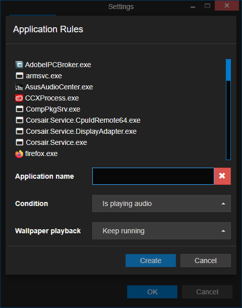

# Le son s'allume et s'éteint par intermittence

Windows ne fait pas de différence entre l'enregistrement et la lecture, il informe donc Wallpaper Engine qu'un autre programme produit du son alors qu'il enregistre en réalité l'audio de votre ordinateur.

Allez dans la section "Performances" des paramètres de Wallpaper Engine. Si vous avez l'option *"Une autre application émet du son"* réglée sur *"Muet"* et que vous remarquez que le son de Wallpaper Engine continue de s'allumer et de s'éteindre, vous avez probablement un programme en arrière-plan enregistrant votre écran et le son.

Pour régler ce problème, voilà trois choses à faire :

* Désactivez le programme d'enregistrement ou reconfigurez-le pour qu'il n'enregistre pas Wallpaper Engine.
    * Ce problème vient souvent de **Nvidia Share / Nvidia GameStream / Nvidia ShadowPlay**. Vous pouvez désactiver ces programmes dans les paramètres de **Nvidia GeForce Experience**. Pour les cartes graphiques AMD, **AMD ReLive** peut également poser problèmes. Il fait partie des drivers des cartes graphiques d'AMD. Si vous ne savez pas ce qui pourrait être en train d'enregistrer, ces logiciels sont de bonnes pistes.
    * Si vous ne savez pas quelles applications sont en cause, vérifier le mélangeur de volume Windows. Vous pourrez y voir quelles applications ont actuellement accès au son de votre ordinateur. Vous pouvez également fermer autant de programmes que possible et vérifier ainsi certains .exe de la liste des processus du gestionnaire de tâches Windows.
* Si l'enregistrement audio en arrière-plan est intentionnel ou si vous ne trouvez pas un moyen de le désactiver, vous pouvez configurer une *règle d'application* dans la section "Performances" des paramètres de Wallpaper Engine. Paramétrez "Condition" sur "Lit un fichier audio" et "Lecture du fond d'écran" sur "Continuer d’exécuter" :

Remplacez certains fichiers .exe par des fichiers .exe que vous pouvez trouver dans le gestionnaire de tâches jusqu'à ce que vous trouviez le coupable.

* Vous pouvez également paramétrer l'option "Autre application lisant un fichier audio" sur "Continuer d’exécuter". Cependant, cela signifie que Wallpaper Engine ne coupera pas automatiquement le son de votre fond d'écran lorsque vous écouterez de la musique ou regarderez des vidéos qui ne sont pas en plein écran.
