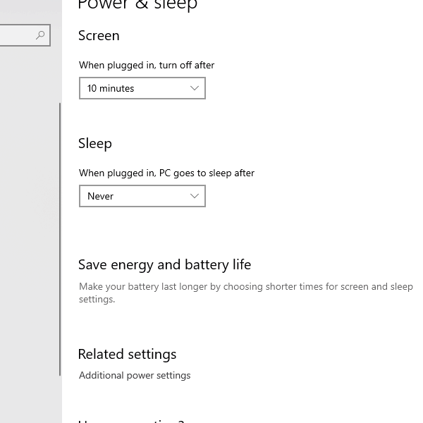

# 최대 절전 모드 / 화면 보호기가 작동하지 않습니다

Windows는 오디오 스트림이 활성화된 상태에서 최대 절전 모드를 진행하지 않습니다. You can get around this by either disabling audio output in the "General" tab of the Wallpaper Engine settings to prevent Windows from blocking hibernation in the first place. If you want to continue to have audio output, follow the steps in this guide on how to achieve that.

## Windows 전원 설정 변경

Windows는 오디오 스트림이 활성화된 상태에서 최대 절전 모드를 진행하지 않습니다. You can get around this by either disabling audio output in the "General" tab of the Wallpaper Engine settings or re-configuring your Windows to allow it to sleep with audio playback enabled:

1. Windows 검색창에 "전원 및 절전 설정"을 입력하여 이동하세요.
2. "추가 전원 설정"을 클릭하세요.
3. 선택한 설정 옆의 "설정 변경"을 클릭하세요.
4. "고급 전원 관리 옵션 설정 변경"을 클릭하세요.
5. 아래로 스크롤해서 "멀티미디어 설정"을 펼치세요.
6. Set "When sharing media" to "Allow the computer to enter away mode" (screensavers) **or** "Allow the computer to sleep" (hibernation)



## "웹" 유형의 배경화면 관련 최대 절전 모드 문제

"Web" wallpapers use a web browser similar to Google Chrome ("CEF") which will prevent hibernation mode. Until this is fixed in the browser, you can get around this with some command-line prompts.

1. Search Windows for "cmd.exe" and right-click on it and select "Run as administrator" (very important, otherwise this will not work!).
2. Use the command `powercfg /requests` to view all processes that are blocking your system from hibernation (also check if other programs may be at fault here).
3. Use the following three commands to permit your system to sleep with Wallpaper Engine running:

```
powercfg /requestsoverride PROCESS webwallpaper32.exe AWAYMODE DISPLAY SYSTEM
powercfg /requestsoverride PROCESS wallpaper32.exe AWAYMODE DISPLAY SYSTEM
powercfg /requestsoverride PROCESS wallpaper64.exe AWAYMODE DISPLAY SYSTEM
```

Additionally, you can also set the **Display asleep** option in the **Performance** tab of the Wallpaper Engine settings to *Stop (free memory)* and turn off your display. That way Wallpaper Engine stops all playback when you turn your display off when leaving your computer unattended.