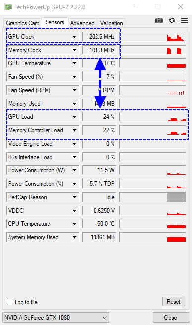

# 높은 GPU 사용 오해

The Windows Task Manager does not show the real GPU usage in most cases which is the cause for a lot of confusion. The GPU usage ignores the *power state* and clock rate of the graphics card which makes it extremely inaccurate and usually shows a much higher GPU usage. To see the real GPU, usage, use a tool like GPU-Z:

* [GPU-Z 다운로드](https://www.techpowerup.com/gpuz/)

## 실제 GPU 로드 확인

GPU-Z를 설치했으면, "센서" 탭에서 GPU 클록 속도와 GPU 로드를 확인하세요:

스크린샷의 *GPU 로드*는 24%입니다. 그러나 상단에서 그래픽 카드가 202.5MHz로 전원 상태가 낮다는 걸 확인할 수 있습니다. '사용량'이 24%로 표시되었지만, 이것은 최상의 시나리오입니다. 최대 클록 속도인 1823mhz를 바탕으로 실제 사용량은 단 **2.6%***(24% * 202.5MHz / 1823MHz)*입니다.

예를 들어, 카드는 100MHz와 2000MHz 사이의 클록 속도를 가질 수 있습니다. 작업 관리자가 50%를 표시하면, **100MHz의 50%인지 2000MHz의 50%인지에 따라 큰 차이가 있습니다**.

::: 팁 요약하자면, GPU 로드를 볼 때 GPU 클록 속도가 중요합니다. 100MHz의 50%가 2000MHZ의 5%보다 좋습니다. :::

GPU 성능을 향상시키고 싶으면:

* Geforce Experience를 포함한 오버레이 및 기록 도구를 비활성화하거나 삭제하세요.
* 프레임 속도 설정을 낮추고 MSAA를 비활성화하세요. (2D 장면 배경화면 품질에 영향을 주지 않습니다)
    * 비디오의 성능에 영향을 주지 않습니다. 프레임 속도와 품질이 고정되어 있습니다.
    * 비디오 배경화면의 해상도와 프레임 속도가 이것을 제어하며, 낮은 FPS의 비디오는 GPU 로드를 줄입니다.
* Connect your monitors to the same GPU or Windows will perform poorly while trying to merge them.