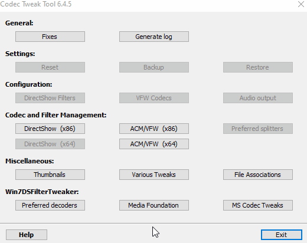

- - -
tags:
  - activemovie window
  - active movie
  - black
- - -

# Vídeos pretos / não são reproduzidos corretamente

Ecrãs pretos e outros problemas com wallpapers do tipo *Vídeo* são *sempre* por controladores de placas gráficas defeituosos ou codecs de vídeo defeituosos. Experiemnte seguir estas instruções pela ordem precisa. Se seguir este guia de alto a baixo, o problema será resolvido:

::: aviso Atenção Este tópico é acerca dos **wallpapers** do Wallpaper Engine estarem pretos ou não serem reproduzidos corretamente. Se o seu **inteface do Wallpaper Engine estiver preto** deve consultar esta página: [Interface para o utilizador do Wallpaper Engine está preto](/interface/broken.html#wallpaper-engine-interface-is-black). :::

## Reinistalação limpa do controlador da placa gráfica

Para a maior parte dos utilizadores, uma reinstalação limpa dos controladores da placa gráfica corrigirá a maior parte dos tipos de problemas relacionados com wallpapers de vídeo. Isto inclui ecrãs pretos e utilizadores cujos wallpapers são apresentados numa janela diferente (intitulada **"Janela ActiveMovie"**).

1. Transfira os controaldores mais recentes para a sua placa gráfica (ou todos, caso possua duas, por exemplo Nvidia e Intel):

* [Nvidia GeForce](https://www.nvidia.com/Download/index.aspx)
* [AMD Radeon](https://www.amd.com/support)
* [Intel Graphics](https://downloadcenter.intel.com/product/80939/Graphics-Drivers)

2. Desinstale completamente os seus atuais c ontroladores de placas gr+aficas e apague todas as definições existentes, caso lhe seja pedido. Os controaldores Nvidia têm ua caixa de verificação que diz "Perform clean re-installation" (Efetuar reinstalação limpa) que também funciona.

Se não tiver a certeza de como o fazer, também pode usar [Display Driver Uninstaller ("DDU")](https://www.guru3d.com/files-details/display-driver-uninstaller-download.html) (Desinstalador de controlador gráfico).

3. Instale os controladores que acabou de transferir no 1.º passo.
4. Volte a reiniciar o seu PC, veja se agora já funciona.

::: tip It's very important that you do a clean re-installation - this means your current graphics card drivers and driver settings have to be completely deleted before you install the new drivers, otherwise it will not work. :::

## Codec Tweak Tool

If it does not work after doing a clean re-installation of your graphics card drivers, try resetting your video codecs:

* Download the Codec Tweak Tool: [Click here](https://www.codecguide.com/download_other.htm)
* Make sure that all checkboxes in the "Media Foundation" menu are **not** checked, then apply the settings:

* Restart the PC and try the affected wallpapers again.

## Additional video codecs

If affected video wallpapers still do not work after the previous steps, download LAV and use DirectShow as described in this guide:

* [Using LAV and DirectShow](/videos/lav.html).