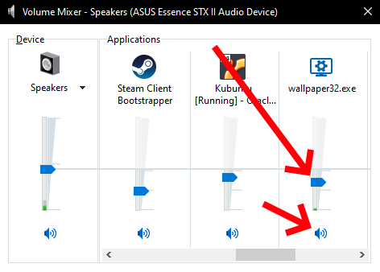

# Аудио визуализаторы не работают / Звук не обнаружен

Есть несколько причин, почему аудио визуализаторы могут не работать. Здесь мы перечисляем все известные возможные причины, пожалуйста, прочитайте полное руководство, чтобы вы не пропустили какие-либо из возможных причин, почему он не работает.

## 1. Настройка звукового устройства
Откройте настройки Wallpaper Engine и перейдите на вкладку «Общее». Ближе к центру вы можете найти секцию "Медиа", в которой вы можете выбрать аудио-устройство. Убедитесь, что выбрано правильное устройство. Если вы не знаете, какое устройство правильное, попробуйте все возможные устройства во время прослушивания музыки, пока аудио визуализаторы не начнут работать.

Если правильное аудиоустройство выбрано, но вы все равно не слышите звук или если ваши аудио визуализаторы не работают, убедитесь, что вы не приглушаете Wallpaper Engine в окне звукового микшера или не установили для него малую громкость. Windows не различает между собой устройства записи и воспроизведения звука. Это означает, что если вы установили низкую громкость в Windows, запись звука также не будет работать:

Если звук обнаружен, но слишком тихий, имейте в виду, что звук приложений (из музыкального проигрывателя, веб-браузера и т. д.) влияет на то, насколько хорошо звук может быть обнаружен. Вы можете усилить обнаружение звука в «Общей» вкладке настроек Wallpaper Engine, если вы не хотите, чтобы повышалась громкость остальных приложений (значение громкости записи по умолчанию равна 50).

## 2. Вопросы аппаратно-специфические

### Corsair Void Pro / Bluetooth / USB наушники или гарнитуры

USB / беспроводные гарнитуры склонны к проблемам драйвера звука. Для многих устройств изменения звуковой частоты дискретизации в настройках устройств Windows до 44100Гц сразу исправляет проблему:

Right-click on the audio icon in the tray area in the lower right corner of Windows, select "Open Sound Settings". Click on "Device Properties" in the "Output" section of the window that opens up. Afterwards, click on "Additional device properties", then navigate to the "Advanced" tab. You can change the sampling rate in the menu shown there. The exact location is different on different versions of Windows. if you cannot find this option, search the web for guides on how to change the sampling rate of sound devices for your version of Windows.

### Razer headsets with THX

Change the audio input in Wallpaper Engine to the 'Speakers (Razer XYZ)' device. This option is in the general settings and any Razer headset with THX effects should work with this solution.

## 3. Conflicting applications

If you believe your audio settings are correct but audio responsive wallpapers do not react to audio, you most likely have sound hardware or software that disables the loopback recording feature on the entire PC. It needs to be configured correctly or removed:

* Nahimic
* Sonic Suite
* Alienware Audio
* Various other applications, especially pre-installed ones on notebooks

If you are unsure if you have any such applications installed, you can also use the Wallpaper Engine scan tool and it will report some programs which are known to cause these issues:

* [Wallpaper Engine Scan Tool](/debug/scantool.html)

