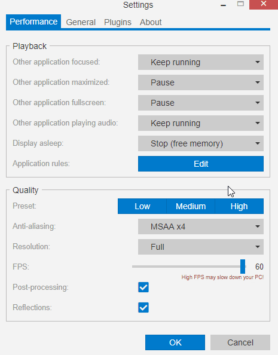

---
tags:
  - uygulama
  - kurallar
  - istisna
  - güvenilir adresler
  - kara liste
  - lags
  - laggy
  - game
  - performance
  - fps
  - crash
  - sound
  - audio
  - intermittent
---

# Fix issues with specific apps or games

If you are experiencing problems with specific applications or games you can configure Wallpaper Engine to behave a certain way when it detects that the app you are having problems with is launched or playing audio, for example.

## Setting up an application rule

In the *Performance* tab of the Wallpaper Engine settings, clicking on the *Edit* button next to the *Application Rules* label will bring up the overview of all custom rules you have set up. By clicking on *Create new rule* you can set up a special behavior of Wallpaper Engine for a specific application.

You will be presented with a list of all running .exe files on your system. Either select an .exe from the list or type in the exact name of the .exe you are having problems with. You can configure the condition and the behavior with the two other options. See below for more infos and concrete examples.

::: tip Wallpaper Engine only cares about the exact .exe name, the location does not matter so you can just type any .exe into the *Application name* field. Just make sure the .exe name matches exactly, including uppercase and lowercase letters. :::

### Fixing performance problems with apps or games

Select the .exe of the program you want to have a special rule for from the list or type it into the **Application name** field. Afterwards, set **Condition** to **Is running** and **Wallpaper playback** to **Stop (free memory)**. This means Wallpaper Engine will completely remove all wallpapers from memory when the application or game is launched, which means any compatibility issues will be resolved.

### Fixing intermittent sound with background recording tools

Select the .exe of the program you want to have a special rule for from the list or type it into the **Application name** field. Afterwards, set **Condition** to **Is playing audio** and **Wallpaper playback** to **Keep running**. This means Wallpaper Engine will not mute itself when the application in question is playing or recording audio. Windows does not differentiate between playing or recording audio, this is why Wallpaper Engine will constantly mute and unmute itself if you are recording it. Many game streaming applications can do this by accident and without your knowledge.

### Other behavior

Check out all possible conditions and wallpaper playback options for more types of application rules. You can also configure Wallpaper Engine to mute or pause when you launch a certain application.

::: tip You can also change these settings for all applications in the **Performance** tab of the Wallpaper Engine settings. If you are having performance issues in multiple games, for example, it may make sense to just change the **Other applications fullscreen** option to **Stop (free memory)** so that Wallpaper Engine will turn itself off when you launch any game or fullscreen application. :::