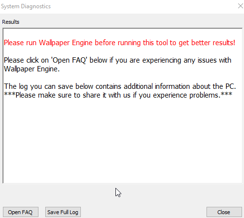

# 使用 Wallpaper Engine 扫描工具创建调试日志

如果 Wallpaper Engine 遇到技术问题，而您无法借助常见问题解答予以解决，则您可以创建系统日志文件，并在与我们联系时分享给我们：

1. 确保 Wallpaper Engine 正在运行（如果可能）。
2. 选择 Steam 中的第 4 个启动选项（*“搜索冲突的应用程序”*，请参看下方的简短视频）：
3. 单击**保存完整日志**，然后将其保存到桌面（请参看下方的简短视频）。
4. 使用以下两种方法之一，将该日志文件分享给开发人员：
    * 访问 [pastebin.com](https://pastebin.com/)，将日志文件的内容复制粘贴到那里，然后分享指向粘贴内容的链接。
    * 或者，您可以将日志文件附加到电子邮件中，然后将其发送给我们。 如果之前已经发送了电子邮件进行讨论，请回复上一封电子邮件，并将日志文件添加为附件。 If this is your first email, please add some information about the problem you were having or a link to an existing discussion.
5. *Optional:* If you are experiencing crashes, please check your *wallpaper_engine* directory for any **.mdmp** files and also send them to us either via email or by uploading them somewhere. If you can find a lot of .mdmp files, please just send the newest ones. ::: tip Even if the scan tool does not report any issues at first glance, a deeper investigation of the log file often reveals common computer issues which help us to quickly provide advice to you how to fix your technical issues. :::

#### Additional video help

**Step 2**

**Step 3**

